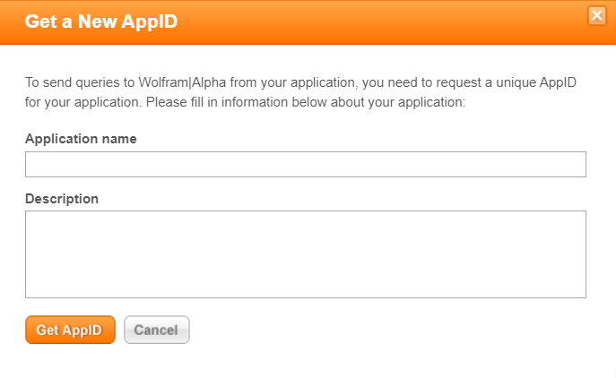

# __Useful information 🔍__

## __Bot implementation pre-requisites:__

---

- ### To succesfuly create a SLACK APP you can jump into: [SLACK CREATE](https://api.slack.com/apps)

  - _Remember to create a slack account and workspace first 👀_
  - _**Update** you can now jump directly to the bot creation here: ↙_
    - [Create Bot](http://slack.com/services/new/bot)

  

- ### Now create the app name and associate it to the Slack Workspace

  

- ### Now it's time to give it some initial setup

  - _You will notice that your API token is available now_

  

---

> ### _*Important remark:*_
>
> To succesfully call your bot after finish the main
> README, you __MUST REMEMBER!__  the username of the bot
> otherwise you won't be able to use it.
>
>__EXAMPLE:__ @examplebot
>
>👀

---

  

### **_Now your Slack APP is ready to keep going_** 👀

---

### **Wolfram Alpha API Engine**

- ### **First comes first, it's time to create a wolfram account**

  - [Create your account here!](https://account.wolfram.com/auth/sign-in)

  

- ### **Now create a wolfram APP**

  

- ### **Now give the app a name and description**

 

- ### Now you can obtain your API Id

  

## Time to start the engine

Now you have succesfully created the APPs tokens.
